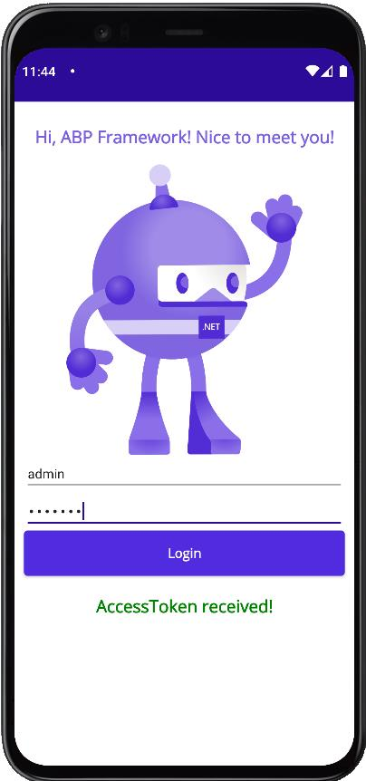

## ABP Framework consumed by .NET MAUI

In this article, I will show you how you can consume an **ABP Framework** application with a **.NET Maui** app.

The ABP Framework application has been developed with **Blazor** as UI framework and **SQL Server** as database provider.

## Source Code

The source code of the ABP Framework and the .NET Maui application is [available on GitHub](https://github.com/bartvanhoey/AbpMaui).

## Requirements

The following tools are needed to run the solution and follow along. You will also need to have Visual Studio 2022 Preview set up for .NET Maui development.

- .NET 6.0 SDK
- Visual Studio 2022 Preview
- Ngrok

## Create ABP Framework application

- Install or update the ABP CLI:

```bash
dotnet tool install -g Volo.Abp.Cli || dotnet tool update -g Volo.Abp.Cli
```

- Use the following ABP CLI command to create a new Blazor ABP application:

```bash
abp new AbpMauiApi -u blazor -o AbpMauiApi
```

### IdentityServer Settings

#### Add AbpMauiApi_Maui section in appsettings.json file of the AbpMauiApi.DbMigrator project

```json
    // change the <replace-me-with-the-abp-api-port> with the port where the Swagger page is running on
    "AbpMauiApi_Maui": {
        "ClientId": "AbpMauiApi_Maui",
        "ClientSecret": "1q2w3e*",
        "RootUrl": "https://localhost:<replace-me-with-the-abp-api-port>/"
    }
```

#### Add Maui client IdentityServer configuration

In the **CreateClientAsync** method in class **IdentityServerDataSeedContributor** of the **AbpMauiApi.Domain** project.

```csharp
    // Maui Client
    var MauiClientId = configurationSection["AbpMauiApi_Maui:ClientId"];
    if (!MauiClientId.IsNullOrWhiteSpace())
    {
        var MauiRootUrl = configurationSection["AbpMauiApi_Maui:RootUrl"].TrimEnd('/');
        await CreateClientAsync(
            name: MauiClientId,
            scopes: commonScopes,
            grantTypes: new[] { "authorization_code", "password" },
            secret: configurationSection["AbpMauiApi_Maui:ClientSecret"]?.Sha256(),
            requireClientSecret: false,
            redirectUri: "mauiclients:/authenticated",
            postLogoutRedirectUri: "mauiclients:/signout-callback-oidc",
            corsOrigins: new[] { MauiRootUrl.RemovePostFix("/") }
        );
    }
```

### Apply Migrations and Run the Application

- Run the `AbpMauiApi.DbMigrator` application to apply the migrations and seed the initial data.
- Run the `AbpMauiApi.HttpApi.Host` application to start the API.

## Ngrok to the rescue

When you are running the ABP Framework API on your local computer, the endpoints are reachable on [https://localhost:\<your-port-number\>/api/\<path\>](https://localhost:<your-port-number>/api/\<path\>).

Although you can test out these endpoints on your local machine, it will fail in a .NET Maui application.
A .NET Maui app considers localhost as its own localhost address (mobile device or emulator) and not that of your computer.

To overcome this problem you can **make use of ngrok**. With ngrok you can **mirror your localhost address to a publicly available url**.

### Download and install ngrok

Go to the [ngrok page](https://ngrok.com/), create an account, and download and install Ngrok.

### Run the Ngrok command

Open a command prompt and enter the command below to start ngrok

```bash
 // change the <replace-me-with-the-abp-api-port> with the port where the Swagger page is running on
ngrok.exe http -region eu https://localhost:<replace-with-the-abp-api-port-number>/
```

After running this command, you will receive the following output:
The API is now publicly available on [https://f7db-2a02-810d-98c0-576c-647e-cd22-5b-e9a3.eu.ngrok.io](https://f7db-2a02-810d-98c0-576c-647e-cd22-5b-e9a3.eu.ngrok.io)


### Copy the ngrok url

Copy the **lower forwarding url** as you will need it for use in the .NET MAUI app.

## Create a .NET Maui app

### Nuget packages

Open the **Package Manager Console** window and run the commands below:

```bash
    dotnet add package Refractored.MvvmHelpers --version 1.6.2
    dotnet add package System.IdentityModel.Tokens.Jwt --version 6.15.1 
```
 
### MainPage.xaml

Replace the content of the MainPage.xaml with the content below:

```html
<ContentPage
  xmlns="http://schemas.microsoft.com/dotnet/2021/maui"
  xmlns:x="http://schemas.microsoft.com/winfx/2009/xaml"
  xmlns:local="clr-namespace:AbpMauiApp.ViewModels;assembly=AbpMauiApp"
  x:Class="AbpMauiApp.MainPage"
  BackgroundColor="{DynamicResource SecondaryColor}">

    <ContentPage.BindingContext>
        <local:MainViewModel />
    </ContentPage.BindingContext>

    <StackLayout Padding="10">
        <Label HorizontalOptions="Center"  Margin="5,15,5,15" Text="Hi, ABP Framework! Nice to meet you!" TextColor="#7b5fdf"  FontSize="18"
            FontAttributes="Bold"/>
        <Image Grid.Row="4"
                Source="dotnet_bot.png"
                SemanticProperties.Description="Cute dot net bot waving hi to you!"
                WidthRequest="250"
                HeightRequest="310"
                HorizontalOptions="Center" />

        <Entry Text="{Binding LoginUserName}" Placeholder="Enter user name..." />
        <Entry Text="{Binding LoginPassword}"  IsPassword="true" Placeholder="Enter password..." />
        <Button Text="Login"  FontAttributes="Bold" Command="{Binding LoginUserCommand}" HorizontalOptions="FillAndExpand" />
        <Label Margin="20" HorizontalOptions="Center"  Text="{Binding LoginUserMessage}" TextColor="Green"  FontSize="18"
            FontAttributes="Bold"/>
    </StackLayout>

</ContentPage>
```

### MainViewModel.cs

Add a **MainViewModel** class in a **ViewModels** folder.

```csharp
using AbpMauiApp.Services;
using MvvmHelpers;
using MvvmHelpers.Commands;
using System.Windows.Input;

namespace AbpMauiApp.ViewModels
{
    public class MainViewModel : BaseViewModel
    {
        private string _loginUserMessage, _loginUserName, _loginPassword;
        private AsyncCommand _loginUserCommand;

        public ICommand LoginUserCommand => _loginUserCommand ??=new AsyncCommand(LoginUserAsync);

        private async Task LoginUserAsync() 
            => LoginUserMessage= await new IdentityService().LoginAsync(LoginUserName, LoginPassword);

        public string LoginUserMessage
        {
            get => _loginUserMessage;
            set => SetProperty(ref _loginUserMessage, value);
        }

        public string LoginUserName
        {
            get => _loginUserName;
            set => SetProperty(ref _loginUserName, value);
        }

        public string LoginPassword
        {
            get => _loginPassword;
            set => SetProperty(ref _loginPassword, value);
        }
    }
}

```

### IdentityService.cs

Add an **IdentityService** class to a **Services** folder

```csharp
using System.Text;
using System.Text.Json;

namespace AbpMauiApp.Services
{
    public class IdentityService
    {
        public async Task<string> LoginAsync(string userName, string password)
        {
            string clientId = "AbpMauiApi_Maui";
            string clientSecret = "1q2w3e*";
            string scope = "email openid profile role phone address AbpMauiApi"; ;
            string ngrokUrl = "<replace-me-with-the-ngrok-url>";

            var data = $"grant_type=password&username={userName}&password={password}&client_id={clientId}&client_secret={clientSecret}&scope={scope}";

            var content = new StringContent(data, Encoding.UTF8, "application/x-www-form-urlencoded");

            var httpClient = new HttpClient(GetHttpClientHandler());
            var response = await httpClient.PostAsync($"{ngrokUrl}/connect/token", content);
            response.EnsureSuccessStatusCode();

            var stringResult = await response.Content.ReadAsStringAsync();
            var loginResult = JsonSerializer.Deserialize<IdentityDto>(stringResult, Options);

            if (string.IsNullOrWhiteSpace(loginResult.access_token)) return "UnAuthorized";
            return "AccessToken received!";
            
        }

        private HttpClientHandler GetHttpClientHandler()
        {
            // EXCEPTION: Javax.Net.Ssl.SSLHandshakeException: 'java.security.cert.CertPathValidatorException:
            // Trust anchor for certification path not found.'
            // SOLUTION: 
            // ATTENTION: DO NOT USE IN PRODUCTION 

            var httpClientHandler = new HttpClientHandler
            {
                ServerCertificateCustomValidationCallback = (message, cert, chain, errors) => { return true; }
            };

            return httpClientHandler;
        }

        private JsonSerializerOptions Options => new()
        {
            WriteIndented = true,
            PropertyNameCaseInsensitive = true 
        };

    }

    public class IdentityDto
    {
        public string access_token { get; set; }
        public int expires_in { get; set; }
        public string token_type { get; set; }
        public string scope { get; set; }
        public string error { get; set; }
        public string error_description { get; set; }
    }

}


```

## Test the result

Run the **HttpApi.Host** project and make sure **Ngrok** is running too.
Start the **.NET Maui app**, enter the credentials (user name: **admin** - password: **1q2w3E***) and click the **Login** button.



Et voilà! As you can see, you received an access token from the **ABP Framework API**. Now you can start consuming the API!

Get the [source code](https://github.com/bartvanhoey/AbpMaui) on GitHub.

Enjoy and have fun!
